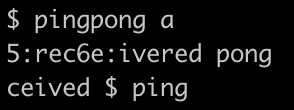

## 此仓库将记录本人学习6.S081所用到的实验

### 欢迎各位学习交流，批评指正

---

首先挂一下课程的连接：https://pdos.csail.mit.edu/6.S081/2021/

### 1.  关于环境搭建的问题

官方文档已经给出详细的安装步骤

https://pdos.csail.mit.edu/6.S081/2021/tools.html

实验过程需要用到risv-v指令的模拟器，qemu工具，在安装riscv的过程中本人由于网络环境的原因一直安装不下来，所幸网络上关于S081课程的资料足够充足，最后采用某博主分享的部署在docker上的已经预装好实验环境的ubuntu系统，成功完成部署，链接如下：

 https://tarplkpqsm.feishu.cn/docs/doccnxrUYjtjuoNnAyxwajplSyf#

后续将会持续更新本人的学习进度。

---

## 实验笔记

###  lab1

- sleep

  在很简单的一项lab，也很合适地放在了第一个lab，因为user/user.h里已经导入了现成的sleep函数，仅需调用即可，对于c语言基础薄弱或者很长时间没有用过的同学来说可以很好的过渡到后续课程。

- pingpong

  使用pipe实现进程之间的通信，也是一个比较简单的lab。但实验手册上给出的例子是利用文件描述符来连接到pipe的，好在XV6已经写好了printf的系统调用，不需要过于纠结这一方面。此外第一次做这个lab时还是有很多纠结的地方的，比如课程中出现的两个进程的输出撞在一起了的情况如何避免，是否需要父进程等待子进程结束之后再输出，子进程无法等待父进程的话如何确定pipe里面是否已经填充数据。

  其中两个进程输出撞在一起的现象影响比较大，可以使用刚用到的sleep调用,或者可以使用wait方法，使父进程等待子进程完成后再执行输出，确保两个进程错开执行。

  

  

  

